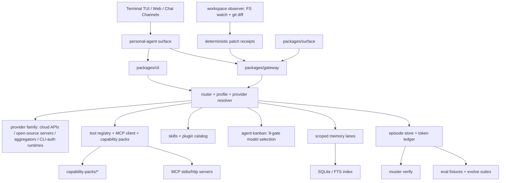

# Muster — the AI agent harness you can audit

**Muster is an open source AI agent harness for governed AI agents: scoped memory, a local token ledger, eval-gated learning, MCP/plugin policy, and an observed — not self-reported — record of every file your agent touches.**

Agents that run for more than a demo need boundaries. They should not leak memory across tenants, burn tokens invisibly, learn new behavior without tests, or tell you what they changed instead of you watching them change it.

Muster keeps those controls outside the model provider, so you can run a self-hosted AI agent on your own models, in your own network, and still hand an auditor a receipt.

[](LICENSE)
[](package.json)
[](tsconfig.base.json)
[](https://www.npmjs.com/package/@musterhq/cli)

**Quick links:** [Website](https://themuster.dev) · [Docs](https://themuster.dev/docs.html) · [Strategy & evidence log](docs/STRATEGY_V2.md) · [Architecture](docs/ARCHITECTURE.md) · [Roadmap](docs/SDLC_KANBAN.md) · [Contributing](CONTRIBUTING.md) · [Issues](https://github.com/Dkm0315/muster/issues)

```bash
pnpm --package=@musterhq/cli dlx muster demo
```

The demo is deterministic and does not need a model key. For the real interactive chat:

```bash
pnpm --package=@musterhq/cli dlx muster
```

That opens the terminal chat surface. First run opens onboarding; after setup it opens a named chat with slash commands, `@agent` routing, provider/model pickers, memory controls, plugin/MCP setup, and the token ledger.

---

## Observed truth: the live inline diff

Most harnesses build their audit trail from what the agent reports it did. We tested whether that report is trustworthy, and it is not.

A wire probe (`scripts/evidence/codex-app-server-probe.mjs`) spawns a real `codex app-server`, runs one real editing turn, timestamps every notification crossing the pipe, and polls the target file every 5ms to establish ordering. The head-to-head runner (`scripts/evidence/workspace-observer-live.mjs`) then attaches Muster's own workspace observer to the same turn and records both streams side by side.

| Signal | Codex app-server | Muster workspace observer |
|---|---|---|
| `item/fileChange/patchUpdated` on real edits | **0 of 5 live runs** | — |
| Real edits captured | — | **2 of 2 runs it was attached to** |
| Detection latency (first disk mutation → emission) | n/a | **75ms** and **86ms** (budget 1000ms) |
| Diff replayability | — | unified diff chain replays byte-exactly under `git apply` |
| Receipt | — | deterministic `receiptHash`, e.g. `sha256:d3b98c8a…` |

Details that matter more than the headline:

- Every edit in every probe run landed through a shell `commandExecution`. The model used the shell, which bypasses Codex's structured patch machinery entirely — the schema field exists, it just does not fire.
- The one diff signal that did appear (`turn/diff/updated`, run 1) arrived at 17729ms — **the same millisecond the file hit disk.** It confirms an edit; it never previews one.
- Two observer processes, in different temp directories, ~40 minutes apart, on the same logical change produced a **byte-identical `receiptHash`**. Receipts are citable evidence, not run-local artifacts.

That third point is the product claim. `packages/core/src/workspace-observer.ts` (1116 lines) derives patch truth from filesystem watching plus git diffing, with sha256 before/after hashes on both ends of every event. `packages/gateway/src/rpc.ts` carries it as a `workspace.patch` RPC event whose `source` field is pinned at the type level to the observer literal — a backend self-report cannot masquerade as observed truth, because the type system will not let it.

**Honest limitation, tracked not hidden:** `workspace.patch.diff` would broadcast raw file content unredacted over the stdio transport. Nothing emits that variant yet, and a redaction layer lands before anything does ([STRATEGY_V2 §9, flag 1](docs/STRATEGY_V2.md)).

Full methodology and re-measured numbers: [docs/STRATEGY_V2.md §2.2 and §9](docs/STRATEGY_V2.md). The finding is version- and model-specific; it should be re-measured against each Codex release, not assumed permanent.

## Agent Kanban: explainable, provider-neutral orchestration

`packages/core/src/agent-kanban.ts` (2156 lines) is an event-sourced board. Board state is a fold over an append-only event log — every transition, assignment, and escalation is replayable, and illegal transitions are rejected by the reducer rather than by convention.

Model selection is the part worth reading. Each candidate model passes through **nine ordered gates** — `retired → capability → provider → residency → cost → latency → context → evidence → wip` — and every gate records why it passed or failed. `renderSelectionRationale()` prints that audit for a human. Model cards carry an explicit evidence kind (`live_probe`, `internal_eval`, `benchmark`, `integration_test`, `vendor_claim`) so a vendor's marketing claim never outranks a measurement you took.

Selection is **fail-closed**. With no qualified card, the board escalates to `needs_intervention` instead of guessing a model. Escalation reasons are distinguished honestly: WIP saturation reports `wip_exhausted`, not `no_qualified_model` — misreporting transient capacity as a permanent capability gap would mislead the auditor reading the log. An agent cannot clear its own escalation, and rework beyond `MAX_TASK_ATTEMPTS` escalates rather than retrying forever.

Adversarial verification found and fixed 8 real bugs before this shipped, including an O(N²) state fold (a 10k-event drive went 2073ms → 224ms) and a planner that proposed assignments the reducer would have rejected. The observer survived a 320-file mutation storm with gapless sequences and correct hash chains. 76 new tests across 4 files back both modules ([STRATEGY_V2 §9](docs/STRATEGY_V2.md)).

## Also shipped in this release train

- **Live inline diff in the chat turn.** Every `WorkspacePatchEvent` the observer detects becomes a diff card appended to the live transcript *while* the turn streams — not a summary printed after it (`packages/cli/src/live-diff.ts`). Rendering is pure and snapshot-tested, the feed never fails a turn (a non-git cwd or missing git binary degrades to one dim notice line), and Muster's own `.muster/` bookkeeping is ignored so the harness never reports its own writes as the model's work.
- **Streamed narration on the wire.** The parent model's narration now streams to every surface, not just the in-process TUI: `RpcEvent` carries `message.delta` and `reasoning.delta` frames (coalesced readable blocks, one shared monotonic `seq` per stream turn), while `message.stop` remains the sole authoritative carrier of the final text — a surface that drops every delta still renders a correct turn. Reasoning deltas can only originate from provider-approved summaries; raw hidden chain-of-thought is never forwarded.
- **Resume Codex sessions from Muster chat.** `/resume <name|id>` reopens a prior named chat, and for Codex-backed runtimes it reopens the persisted provider thread (`threadOpenState: resumed`) instead of paying to replay context into a cold one. Warm app-server processes are cached per conversation, so switching chats does not tear down another chat's runtime.
- **Adopt the Codex threads you already have.** `muster codex sessions` reads `CODEX_HOME` and lists your real threads; `muster codex resume <id-prefix>` imports the transcript into Muster's session store (so search, memory, and the token ledger cover it) and hands the next turn the native thread id, so Codex continues with its own context. Verified live on the development machine (re-measured 2026-08-27): a 440+ rollout CODEX_HOME scans in well under half a second, multi-agent subagent threads are hidden by default, and a resumed thread answered a question about a turn taken before Muster was involved with `recalled=0` from Muster memory — the answer came from Codex's own server-side context, not a replay. Rollouts here reach 3 GB, so every read is a bounded stream and CODEX_HOME is strictly read-only.
- **Scoped runtime v1.** The active runtime + provider + model bind to a scope rather than to one global default, so changing provider in one chat cannot silently re-route another tenant's or another session's work.
- **AI agent memory: stemming fix.** Scoped memory search now matches morphological variants — a query for `deploy` finds `deployed` and `deployment` — instead of missing recall that the FTS index physically contained. Recall you cannot reach is worse than no recall, because it looks like an answer.

## Latest terminal launch demo


**Watch the latest slowed launch video:** [MP4](docs/assets/muster-terminal-launch-demo.mp4) · [GIF](docs/assets/muster-terminal-launch-demo.gif)

This is the latest terminal video from the current launch flow: onboarding/product context, governed chat, channel setup, MCP setup, live token ledger, and integrity checks. It uses the real Muster terminal colors and the same demo path a new user can run locally. The GIF is for inline GitHub preview; the MP4 is the higher-quality asset for Telegram, LinkedIn, GitHub release notes, and launch posts.

| Asset | Use |
|---|---|
| [Slowed terminal GIF](docs/assets/muster-terminal-launch-demo.gif) | Inline GitHub/README preview |
| [Slowed launch MP4](docs/assets/muster-terminal-launch-demo.mp4) | Telegram, LinkedIn, GitHub release notes, and richer demos |
| [Recording script](docs/assets/muster-terminal-launch-demo.tape) | Reproducible terminal capture source |

Today you can run the same path locally — this is the actual output of `muster demo`:

```text
muster demo — provisioned an isolated workspace and a live stub model service.

> Where do we deploy?
  (recalled 1 scoped memory)
  Muster deploys to uat-erp.example.com (recalled from scoped memory).

> Summarize the day's work.
  Demo run complete. Every token above is real, recorded to the ledger.

run            model                        in       out      est  cost$    waste   session
----------------------------------------------------------------------------------------------
981ac134-709e- demo/demo-model              38       17       ~    -        -       -
9c210b2c-9626- demo/demo-model              7        18       ~    -        -       -

totals by model              runs   in         out        cost$      waste-runs
--------------------------------------------------------------------------------
demo/demo-model              2      45         35         ?          0

note: 2 run(s) ran on models with no price match — cost totals above are a LOWER BOUND
(those runs counted as $0). "+" marks a model whose total excludes unpriced runs.

integrity check at 2026-08-27T17:22:20.920Z: OK

store      lines    corrupt
---------- -------- --------
episodes   2        0
feedback   0        0
memory     3        0
tokens     2        0

That was a real run loop: scoped memory recall, token ledger, integrity verification — on a throwaway workspace.
```

## Evidence, not claims

Every number in this README is reproducible from a script in this repository. Where we cannot reproduce something, we say so instead of rounding it up.

| Script | What it proves | Run it |
|---|---|---|
| [`scripts/evidence/codex-app-server-probe.mjs`](scripts/evidence/codex-app-server-probe.mjs) | Whether a real Codex turn emits structured file-change events before the file lands on disk | `node scripts/evidence/codex-app-server-probe.mjs` |
| [`scripts/evidence/workspace-observer-live.mjs`](scripts/evidence/workspace-observer-live.mjs) | Head-to-head: observer diff chain replays under `git apply`, latency under budget, final hash matches disk | `pnpm build && node scripts/evidence/workspace-observer-live.mjs` |
| [`benchmark/run.mjs`](benchmark/run.mjs) | Token Waste Index — deterministic, zero model calls | `node benchmark/run.mjs` or `muster benchmark` |
| [`scripts/evidence/video-evidence.mjs`](scripts/evidence/video-evidence.mjs) | Hashed, ffprobe-verified index for demo recordings; partial manifests fail release validation by design | `pnpm evidence:video` |
| [`scripts/evidence/test/`](scripts/evidence/test) | The evidence tooling's own contracts (35 tests) | `pnpm test:evidence` |
| `muster verify` | Integrity check over episodes, memory, and token stores | `muster verify` |

Two of these are honest about their limits. `workspace-observer-live.mjs` needs an authenticated Codex CLI, so it is a manual evidence job rather than unattended CI; it exits `2` with a "skipped" status and the exact error rather than fabricating a number. The video evidence index refuses to count a scenario as proven until a real recording and its supporting files exist.

Suite state at the time of writing, re-measured in a fresh session (2026-08-27): `@musterhq/core` **682/682 pass**, `@musterhq/gateway` **429/429 pass**, `@musterhq/cli` **132/132 pass**, evidence tooling **35/35 pass**.

## Proof: Token Waste Index

`muster benchmark` compares Muster against naive replay-everything context rendering. It is deterministic and makes no model calls.

| Scenario set | Turns | Naive tokens | Muster tokens | Reduction |
|---|---:|---:|---:|---:|
| Aggregate benchmark | 170 | 875.8k | 355.2k | 59.4% |

Full methodology, per-scenario numbers, and what the columns do *not* mean: [benchmark/RESULTS.md](benchmark/RESULTS.md).

## Product surface

Muster is not only a run loop. It is the controlled operating layer around the agent someone actually uses every day: **tools** (shell, files, git, browser, web search, Frappe/ERPNext, channels, MCP) running under policy with receipts and caps; **skills** that are listable, curatable, and attributed in the token ledger; **plugins** whose catalog marks what is executable today versus what is only a setup plan; **office artifacts** (real DOCX/XLSX/PPTX/PDF from a zero-dependency ZIP writer, and deliberately minimal — see [§2.3](docs/STRATEGY_V2.md)); **AI agent memory** scoped across tenant, workspace, user, role, session, tags, and time; **orchestration** through the event-sourced kanban; **workspace truth** from FS + git observation; **channels** for Telegram, Slack, Discord, WhatsApp, Google Chat, Teams, and web; and a **personal agent surface** that starts in the terminal and reaches the gateway and web.

## Why Muster exists

Most agents fail after the demo.

Long-running agents start clean, then accumulate hidden state:

- context grows until every turn replays too much history
- memory becomes unsafe when user, tenant, workspace, and session boundaries blur
- token usage disappears into provider logs instead of a local ledger
- "learning" becomes risky when feedback promotes behavior without evals
- automation becomes brittle when tools, MCP servers, browser actions, and app writes have no shared policy envelope
- **the audit trail records what the agent said it did, which — measurably — is not what it did**

Governed AI agents need those controls to live outside the model provider. That is what Muster is.

## What Muster does

| Problem | Muster control |
|---|---|
| The agent's self-report is not the truth | **Workspace observer** derives file changes from FS watch + git diff with sha256 before/after and a deterministic receipt hash. |
| Memory can leak across users or projects | **Scoped memory** with tenant, workspace, user, role, and session lanes, backed by SQLite/FTS retrieval and leakage tests. |
| Token cost becomes invisible | **Token ledger** records every run, estimates or records usage, and flags replay waste. |
| Model choice is opaque or vendor-captured | **Nine-gate model selection** scores every candidate on capability, provider, residency, cost, latency, context, and evidence — and prints the rationale. |
| Work is assigned without accountability | **Event-sourced kanban** replays every transition and escalates fail-closed instead of guessing. |
| Tools run without boundaries | **Governed execution** routes tools, flows, subagents, browser work, and channels through explicit config, policy, and evidence. |
| Agents "learn" from vibes | **Eval-gated learning** turns feedback into replayable fixtures before behavior is promoted. |
| Integrations sprawl | **Capability packs** bundle typed tools, declared secrets, permissions, and setup guidance. |
| MCP servers are useful but risky | **MCP/plugin support** adds stdio/http servers with include/exclude policy, result caps, circuit breakers, and OAuth/PKCE helpers. |
| Chat apps need a reliable backend | **Channel adapters** connect Telegram, Slack, Discord, WhatsApp, Google Chat, Teams, and webhooks to the same governed harness. |
| ERP systems need domain context | **Frappe/ERPNext support** ships as a capability pack with permission-scoped tools and docs/live-context setup. |
| Provider choice should stay flexible | **Multi-provider LLM support** across cloud APIs, open-source/self-hosted servers, aggregators, OpenAI-compatible endpoints, Gemini, Groq, Cerebras, Mistral, DeepSeek, Kimi, Qwen, OpenRouter, Together, Fireworks, LM Studio, vLLM, SGLang, Pi, Codex CLI, and Claude Code CLI. |

## Quick start

### Prerequisites

- Node.js 24 or newer
- `pnpm` 10.x for repository development
- Optional: a configured provider key or local agent CLI for live model calls

### Try without a model key

```bash
pnpm --package=@musterhq/cli dlx muster demo
pnpm --package=@musterhq/cli dlx muster benchmark
```

`muster demo` uses a stub model service and an isolated workspace. `muster benchmark` is deterministic and makes no model calls.

### Install from source

```bash
git clone https://github.com/Dkm0315/muster.git
cd muster
pnpm install
pnpm build
pnpm hc demo
```

### Install a daily-driver `muster` command

For day-to-day use from any directory, put a small shim on your `PATH` that runs the built CLI (rebuilds are picked up automatically because the shim points at `dist`):

```bash
mkdir -p ~/.local/bin
cat > ~/.local/bin/muster <<'EOF'
#!/bin/sh
exec node --disable-warning=ExperimentalWarning "/absolute/path/to/muster/packages/cli/dist/index.js" "$@"
EOF
chmod +x ~/.local/bin/muster
```

Ensure `~/.local/bin` is on your `PATH`, then `muster version` from anywhere confirms the shim works. After editing `packages/cli/src` or `packages/core/src`, run `pnpm build` so `dist` is current.

### Start a workspace

```bash
muster                 # interactive TUI; first run opens onboarding
muster onboard         # rerun guided setup
muster doctor --fix    # repair/check local config
muster status          # one-screen status
```

### Add a provider

Use presets when possible:

```bash
muster provider presets
muster provider add openai
muster runtime use-provider native openai
```

Common environment variables:

```bash
OPENAI_API_KEY=...
ANTHROPIC_API_KEY=...
GEMINI_API_KEY=...
GROQ_API_KEY=...
OPENROUTER_API_KEY=...
MISTRAL_API_KEY=...
DEEPSEEK_API_KEY=...
TOGETHER_API_KEY=...
```

For a self-hosted AI agent on your own inference endpoint:

```bash
muster provider add-openai-compatible private http://localhost:8000/v1 served-model
muster runtime use-provider native private
```

### Smallest working commands

```bash
muster run "Say hi in one sentence"
muster tokens
muster memory add --summary "uat deploy target is uat-erp.example.com" --scope user:me --provenance manual
muster memory search --scope user:me --query "deploy target"
muster verify
```

## Architecture

Muster is a TypeScript monorepo. The CLI is the main entry point; the core package owns governance, memory, providers, packs, flows, ledgers, orchestration, and evals; the gateway and surface packages expose web/chat entry points.



Key directories:

- `packages/cli` — terminal chat, setup, commands, TUI, QA harnesses
- `packages/core` — run loop, memory, providers, MCP, capability packs, flows, ledgers, evals, workspace observer, agent kanban
- `packages/gateway` — HTTP gateway, JSON-RPC contract, and channel/webhook adapters
- `packages/surface` — zero-dependency web client surface
- `capability-packs` — bundled packs such as Frappe/ERPNext, browser, web search, providers, channels
- `scripts/evidence` — reproducible evidence scripts behind the claims in this README
- `docs` — architecture, strategy and evidence log, flow engine, setup/migration, retrieval, parity notes
- `website` — static Vite site for [themuster.dev](https://themuster.dev)

Muster uses provider APIs, OpenAI-compatible servers, aggregators, self-hosted open-source inference, and native agent CLIs where useful, but keeps governance outside the provider: scoped memory, token accounting, evidence, eval gates, MCP policy, workspace observation, and integrity verification remain Muster-owned. Backends swap; governance does not.

## Real-world use cases

- **Governed coding work**: let an agent edit a repository while every change is observed, hashed, diffed, and receipted — independent of which tool the model reached for.
- **Frappe / ERPNext operator workflows**: build scoped context from Frappe/ERPNext docs, installed apps, DocTypes, fields, workflows, and records before acting through permission-scoped tools.
- **Multi-model routing with an audit trail**: route work across providers by capability, cost, latency, residency, and evidence, and keep the rationale for every routing decision.
- **Regulated / in-region deployments**: residency is a selection gate, not a comment — a task marked `on_premise` cannot silently route to a cloud model.
- **Governed long-running agents**: keep sessions, memory, token spend, and learning visible over days or weeks.
- **MCP-based capability extension**: attach MCP servers with per-server policy, result caps, OAuth setup, and failure isolation.

## Comparison

Muster is not trying to replace every agent harness, and pretending otherwise would be the first thing to distrust about it.

| Harness | Scale (verified) | What it genuinely does better |
|---|---|---|
| [OpenClaw](https://github.com/openclaw/openclaw) | 387.8k ★, 83,433 commits | Gateway control plane; WhatsApp/Telegram/Slack/Discord/GChat/Signal/iMessage; Plugin SDK; Control UI + CLI + TUI; voice/canvas/camera |
| [Hermes Agent](https://github.com/nousresearch/hermes-agent) | 237.1k ★ | 40+ tools across 7 terminal backends; FTS5 cross-session search with LLM summarization; autonomous skill creation; follows the agentskills.io open standard |
| [DeepSeek Harness](https://github.com/deepseek-ai/deepseek-harness) | ~170k ★ | Append-only session event log as durable source; no privileged core — every component, including the agent loop, is config-replaceable |
| [QM](https://github.com/yc-software/qm) | 14.3k ★ | Per-person and per-room scopes with their own memory, files, keychain, permissions, crons; skills shareable by grant with admin-gated org promotion; durable sandbox |
| [OpenHarness](https://github.com/HKUDS/OpenHarness) | 14.7k ★ | Python; broad provider coverage across Claude/OpenAI/Copilot/Codex/Kimi/GLM/MiniMax/NVIDIA NIM |

**The honest read.** These ecosystems are deeper than Muster's on breadth, and the gap is not close. OpenClaw has a Plugin SDK and 83k commits of integration work. Hermes has seven execution backends. DeepSeek Harness removes the privileged core entirely. QM's sharing model — grants, audiences, admin-gated promotion — is genuinely ahead of Muster's, which has no sharing primitive yet at all. Muster ships 34 capability packs of which two are substantial and 31 have zero tests. **Muster cannot win a breadth race and has stopped entering one.**

Muster's wedge is narrower and, so far, uncontested: **observed-truth auditability, governed AI agent memory, and a live diff derived from the workspace rather than from the agent's self-report.** Per the fetched documentation for each project above, no surveyed harness derives an authoritative, receipted workspace patch stream from filesystem observation — and §2.2 shows why that matters: the competitors' own edit trails are incomplete, and nobody has noticed. Cursor has the ergonomics and none of the governance. OpenClaw and Hermes have the ecosystem and no audit spine. Compliance vendors have paperwork and no runtime. Muster's opening is the overlap.

If you are shopping for an OpenClaw alternative because you need channel breadth today, use OpenClaw. Come to Muster when you need to prove to someone else what your agents did.

## Implementation status

Muster is pre-1.0. Core governance paths are implemented and tested; public APIs and integration surfaces may still change.

| Area | Current state |
|---|---|
| Workspace observer | Implemented and live-proven twice against `codex app-server`. Deterministic receipts, git-apply-verified diff chains, 320-file stress coverage. Diff redaction before broadcast is the tracked open item. |
| Agent kanban | Implemented. Event-sourced board, legal-transition reducer, nine-gate explainable selection, fail-closed escalation, dependency-cycle detection, WIP limits. |
| Event spine | `run-events.ts` implements 21 typed append-only event types with fencing, idempotency, and a reducer-enforced no-secrets/no-chain-of-thought invariant. Adopted on the Frappe mission path and the gateway; adoption in the universal `run.ts` loop is the next item on the board. |
| RPC contract | One newline-delimited JSON-RPC 2.0 protocol over stdio, HTTP, and NDJSON. `RpcEvent` now carries 8 variants including `message.delta`, `reasoning.delta`, `workspace.patch`, `task.transition`, and `task.assigned`. Growing this vocabulary is what unlocks richer surfaces. |
| CLI/TUI | Implemented. `muster` opens the chat UI after onboarding with slash-command completion, `@agent` completion, history, named sessions, Codex session resume, provider/model/runtime pickers, and token/plugin/skill/MCP/memory commands. |
| Provider/runtime path | Implemented for direct APIs, OpenAI-compatible providers, aggregators, local/self-hosted servers, Pi, Codex CLI, and Claude Code CLI. Presets include OpenAI, Anthropic, Gemini, xAI, Kimi, DeepSeek, Mistral, Qwen, Zhipu, Perplexity, Groq, Cerebras, OpenRouter, Together, Fireworks, LM Studio, vLLM, and SGLang. |
| Memory | Implemented. Scoped memory uses SQLite/FTS with stemmed matching, receipt reporting, graph-linked expansion, latency probes, rebuild/doctor commands, and leakage tests. No delete, supersede, expire, revoke, or grant primitives yet — that is Wave 2, and it is a real gap. |
| Token/cost | Implemented. Per-run ledger, cost estimates where pricing is known, replay-waste detection, session mode/id tracking, and skill attribution. Unpriced models are reported as a lower bound, never silently as zero. |
| Tools / Skills / Plugins | Implemented base systems. In-repo capability packs are executable; catalog entries are marked by actionability so setup-only packs never pretend to be live runtime integrations. 31 of 34 packs have no tests — see [§2.4](docs/STRATEGY_V2.md). |
| Office artifacts | Implemented as the `artifact-studio` pack. Real DOCX/XLSX/PPTX/PDF that system parsers open, hand-rolled with a zero-dependency ZIP writer — and minimal: no tables, images, charts, themes, formulas, or multiple sheets. |
| MCP | Implemented client, stdio/http registration, include/exclude policy, result caps, circuit breakers, OAuth/PKCE setup/import, and curated install catalog. |
| Frappe/ERPNext | Implemented as a capability pack with docs/live-context setup, module/doc resources, Frappe tools, retrieval eval fixtures, and web-framework checks. The deepest vertical in the repo by a wide margin. |
| Gateway/channels | Framework and setup packs exist for Telegram, Slack, Discord, WhatsApp, Google Chat, Teams, and web. Production hardening depends on real provider credentials and webhook setup. |
| Latency | Timings are collected but there is no CI gate yet. A first-token budget (p95 < 2.0s warm, < 4.0s cold) is queued. |
| Dashboard/web UI | Basic status/export/start surfaces exist. A full dashboard/desktop app is not done. |

## Roadmap

The detailed working board lives in [docs/SDLC_KANBAN.md](docs/SDLC_KANBAN.md); the strategy and its gates live in [docs/STRATEGY_V2.md](docs/STRATEGY_V2.md). Each item is done when its number is true in CI, not when the code merges.

### Now

1. **`run.ts` emits RunEvents for every run, tool call, and file effect** — gate: 100% of runs reconstructable from the log alone, with workspace patch receipts wired in.
2. **Redaction layer for `workspace.patch.diff`** before any surface emits it — diff text in evidence, receipt in payload.
3. **First-token latency gate in CI**, against timings the Codex adapter already collects.

### Next

- Long-transcript recall exam: published, non-regressing recall at 10k / 100k / 500k tokens
- QA Lab scenario DSL with repo/DB/permission/artifact oracles; LLM judging capped at 20% of assertions and never the sole authority
- Memory V3: supersession and contradiction records, lifecycle (expiry, retention, erasure, legal hold), and real grants with audience, purpose, expiry, and revocation
- Explainable recall — why selected, which grant, freshness, token cost — on every recalled item

### Later

- Coding daily-driver: worktrees, checkpoints, session fork/resume, background terminals, PR review, and an IDE live-diff extension fed by the observer. Gate: Muster fixes a real bug in this repository and opens a reviewable PR with the full turn reconstructable from the event log.
- India regulated profile: deny-by-default egress, provider allowlists, model registry, DLP/PII classification, SBOM/AIBOM, and policy mappings for RBI / SEBI / IRDAI / CERT-In / DPDP — with the evidence pack generated from the spine, not hand-assembled.
- Community capability-pack registry, more channel adapters, richer dashboard/desktop surfaces.

Hybrid retrieval (vectors + graph + BM25) ships only after the recall exam proves it beats the lexical baseline. If it cannot, it does not ship.

## Contributing

Contributions are welcome. Start small and keep changes testable.

```bash
pnpm install
pnpm typecheck
pnpm test
pnpm hc demo
```

Per-package suites while iterating:

```bash
pnpm --filter @musterhq/core test
pnpm --filter @musterhq/gateway test
pnpm --filter @musterhq/cli test
pnpm test:evidence
```

Good contribution areas:

- capability-pack tests — 31 of 34 packs have none, and this is the sharpest internal gap
- documentation, examples, demo recordings, and screenshots
- Frappe/ERPNext packs, eval fixtures, and retrieval tests
- provider adapters and latency benchmarks
- MCP setup workflows and auth failure tests
- TUI interaction tests and browser automation examples
- channel adapters, live diagnostics, and setup guides

Look for [`good first issue`](https://github.com/Dkm0315/muster/issues?q=is%3Aissue+is%3Aopen+label%3A%22good+first+issue%22) and [`help wanted`](https://github.com/Dkm0315/muster/issues?q=is%3Aissue+is%3Aopen+label%3A%22help+wanted%22). For larger work, open an issue first so the design can be reviewed before code.

## FAQ

### Is Muster another agent framework?

Not exactly. Muster is a governed harness around agents. It routes to agent CLIs, OpenAI-compatible providers, MCP servers, capability packs, and gateway surfaces while keeping memory, tokens, learning, tool policy, and file changes auditable.

### What actually makes it different?

Muster does not ask the agent what it changed. It watches the workspace and derives the patch itself, with hashes on both ends and a receipt that reproduces across machines. Across five live Codex runs, the backend's structured file-change stream reported zero of the real edits; the observer reported them in under 100ms. That is the whole thesis in one measurement.

### Is Muster an OpenClaw alternative?

Only for a specific reason. OpenClaw is far broader — more channels, more plugins, a mature Plugin SDK, orders of magnitude more contributors. Pick Muster when the requirement is auditability: scoped memory boundaries you can test, a token ledger you own, model selection you can explain gate by gate, and an edit trail that does not depend on the agent's honesty.

### Can I resume Codex sessions?

Yes, including the ones you started in raw Codex before you had Muster. `muster codex sessions` lists the threads in your `CODEX_HOME`, and `muster codex resume <id-prefix>` imports that transcript into Muster's session store and continues the **native** Codex thread — the next turn runs against the provider's own server-side context, not a replay. Inside the chat TUI, `/resume <name|id>` reopens a prior named chat and Codex-backed runtimes reopen the persisted provider thread rather than starting cold. Warm app-server processes are cached per conversation.

### Can I run it fully self-hosted?

Yes. Point Muster at any OpenAI-compatible endpoint — vLLM, SGLang, LM Studio, or your own gateway — with `muster provider add-openai-compatible`. Memory, ledger, receipts, and evidence stay on local disk. Residency is also a first-class model-selection gate, so a task marked `on_premise` cannot route to a cloud model.

### How does AI agent memory stay safe across tenants?

Memory is written and read through explicit scopes — tenant, workspace, user, role, session — indexed in SQLite/FTS with leakage tests that fail the build when cross-scope recall happens. Lifecycle controls (supersession, expiry, revocation, grants) are the honest gap and are next on the roadmap.

### Does it support MCP?

Yes. Stdio and HTTP MCP servers, include/exclude policy, result caps, circuit breakers, OAuth/PKCE setup, and a curated install catalog.

### Does it work with Frappe/ERPNext?

Yes. The Frappe/ERPNext capability pack lives in `capability-packs/frappe` and supports permission-scoped tools plus docs/live-context setup. It is the deepest vertical in the repo.

### Why should I trust these numbers?

Do not — reproduce them. Every claim above points at a script in [`scripts/evidence/`](scripts/evidence) or a test suite you can run. Where a measurement needs credentials we cannot ship, the script says "skipped" rather than inventing a result.

## License

MIT. Open source, community-driven.
